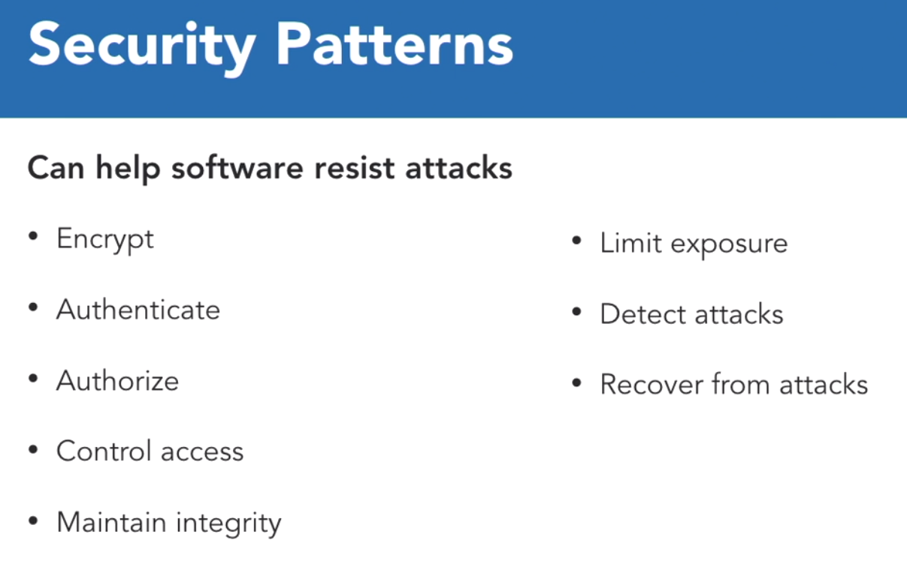

# Python - Advanced Design Patterns

## Understanding Design Patterns: review

### Design Patterns

### Architectural Patterns

## Design Best Practices

### Secutiry Patterns: Intercepting Validator

## Gang of Four (GoF) Patterns

### 01 - Facade

- Reduces complexity
- Protects client classes
- Promotes loose coupling
- Increases maintainability
- Does not prevent direct access to subsystem interfaces

### 02 - Command

- Compose sequence of behavior
- Undo actions

### 03 - Interpreter

#### Terminal Expression

- End
- Single Type

#### Non-terminal Expression

- Variations
- Tasks

### 04 - Mediator

- Loose coupling
- Better maintainability

### 05 - Memento

- Captures the internal state of an object
- Restores the same state

### 06 - State

### 07 - Template

- Stricter polymorphism
- Select methods to be overridden
- Protected methods
- Extracts behavioral commonalities among similar classes
- Help avoid widespread changes
