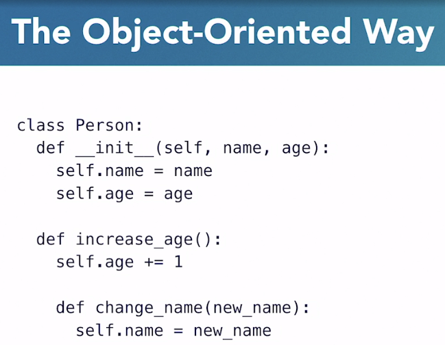

# Functional Programming With Python

## Introductory Funcional Concepts

### Imperative vs. Declarative Programming

### Core Concepts of Functional Programming

#### Immutability

#### Separating functions and data

#### First-class functions

## First-Class Functions

## Python: The Functional Parts

## Advanced Functional Concepts
