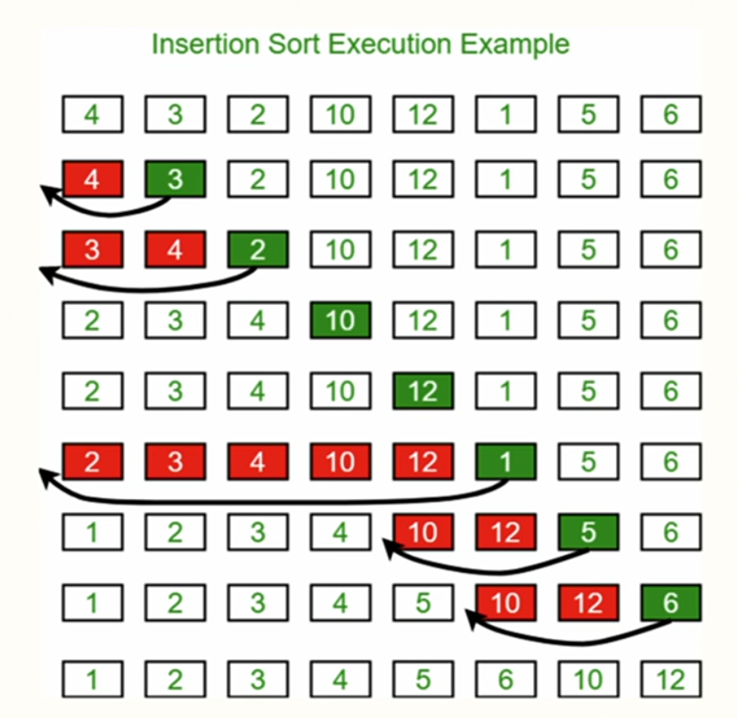
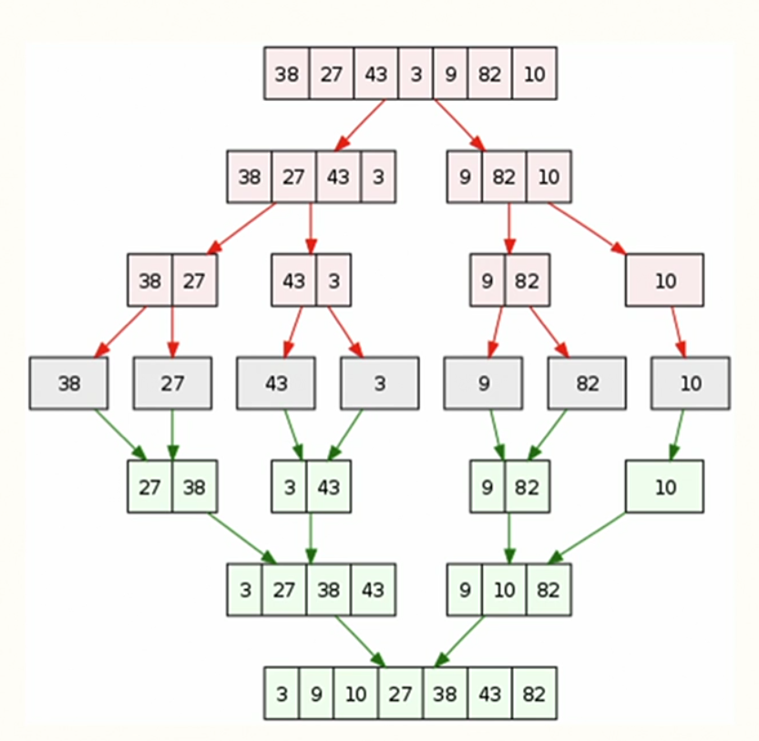
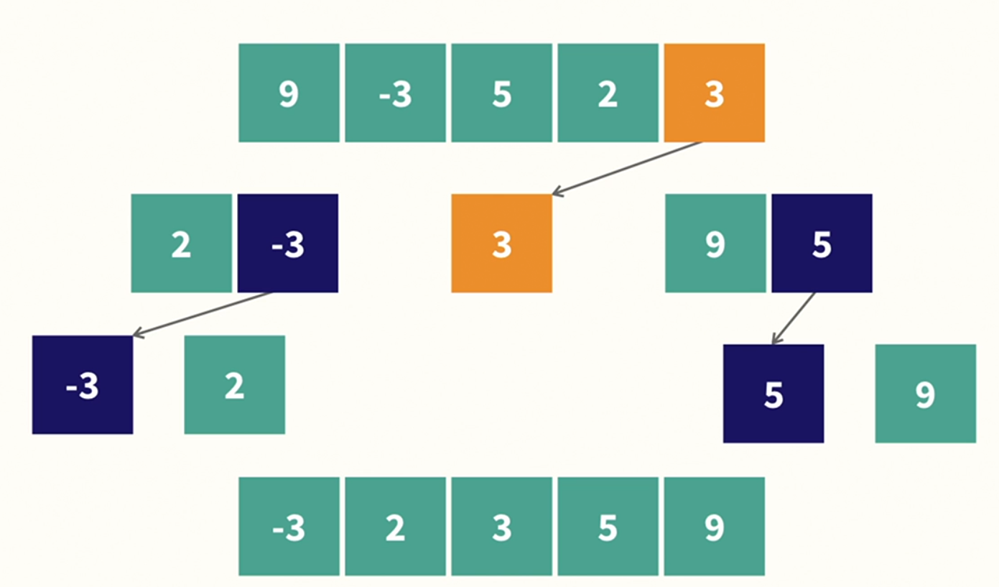
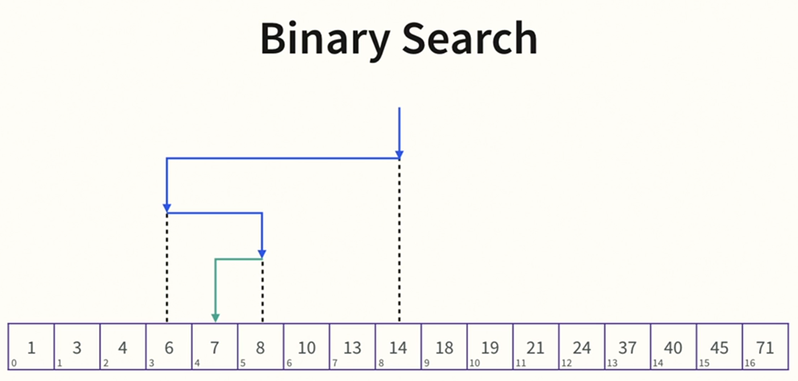
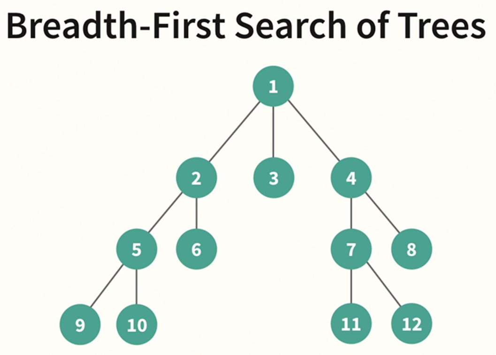
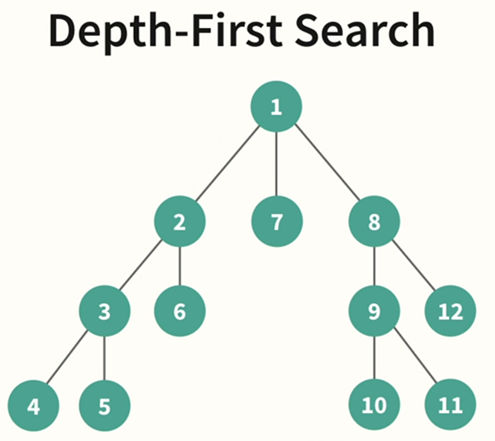

# NAIL Python

## Personal and Nontechnical

### Personal

- Emotional intelligence
- Intellectual maturity
- Curiosity
- Perseverance
- Confidence

### Nontechnical skills

- Problem-solving ability
- Asking good questions
- Understanding one's assumptions
- Understanding constraints
- Collaboration

## Collections

### Tuples

- Immutable
- Ordered
- Iterable

```python
tup = (1,2,3,5)
print(tup[0])       # 1
print(len(tup))     # 4
print(tup.count(2)) # 1
print(tup.index(5)) # 3
```

### Lists

- Mutable
- Ordered
- Iterable (Linear time)

```python
lt = [1,2,3,5]
print(lt[0])            # 1
print(len(lt))          # 4
print(lt.append(7))     # None
print(lt)               # [1,2,3,5,7]
print(lt.insert(-1, 9)) # None
print(lt)               # [1,2,3,5,9,7]
print(lt.pop())         # 7
print(lt)               # [1,2,3,5,9]
print(lt.remove(9))     # None
print(lt)               # [1,2,3,5]
print(lt.reverse())     # None
print(lt)               # [5,3,2,1]
print(lt.sort())        # None
print(lt)               # [1,2,3,5]
```

### Dictionaries

- Keys and values
- Mutable
- Iterable (Constant time)
- Ordered by time of insertion in Python 3.7+

```python
dic = {'whatever': 1, 'else': 2, 'matters': 3}
print(dic['else'])          # 2
print(list(dic.keys()))     # ['whatever', 'else', 'matters']
print(list(dic.values()))   # [1, 2, 3]
print(list(dic.items()))    # [('whatever', 1), ('else', 2), ('matters', 3)]
print(dic.pop('matters'))   # 3
del dic['else']
print(dic)                  # {'whatever': 1}
```

### Sets

- Mutable
- Unordered
- Iterable (constant time)
- Unique items

```python
set1 = {1,2,3,4,5}
set2 = {2,4,6,8}
print(set1.add(6))              # None
print(set1)                     # {1,2,3,4,5,6}
print(set2.update({9,10}))      # None
print(set2)                     # {2,4,6,8,9,10}
print(set2.remove(9))           # None
print(set2)                     # {2,4,6,8,10}
print(set1.intersection(set2))  # {2,4,6}
print(set2.difference(set1))    # {8,10}
```

## Time Complexity

- O(1)
- O(logN)
- O(N)
- O(NlogN)
- O(N^2)
- O(2^N)
- O(N!)

## Recursion

- Define base case
- Call itself until reach the base case
- Change internal state at every loop

## OOP

- Abstraction
- Encapsulation
- Inheritance
- Polymorphism

## Linear Data Structures

### Stacks: `LIFO`

- Add and remove items in constant time
- Mantain the order they were added
- Quick access to the most recent item, keeping things in order

### Queues: `FIFO`

- Add items in constant time
- Remove items in linear time
- Mantain items in order
- Process things in the order they were added

### Singly-linked lists

- Connected nodes
- Can only move forward
- Adds and removes nodes before or after any key in the linked list
- Ordered
- Best suitable when:
  - Unknown number of items to store
  - One-directional movement is OK
  - Need to insert items in between other items
  - Sequential access is OK

### Doubly-linked lists

- Can move foward and backward
- Adds and removes nodes before or after any key in the linked list
- Ordered
- Best suitable when:
  - When moving backward

## Non-linear Data Structures

### Trees

- Simulates a hierachical tree structure with a root node and zero or more subtrees
- Parent, child, and sibling nodes

### Binary Search Trees

- Root node is roughly the midpoint
- Smaller nodes on the left
- Larger nodes on the right
- Takes O(logN) comparisons to find a specific node
- Worst-case search is O(h)

### Graphs

- A finite set of nodes `points` connected by lines `edges`
- Edges can optionally have values (weighted)
- Store data in a way that captures relationships between nodes

### HashMaps

- Maps keys to values
- A hash function converts the key into an index
- This index is used to find the key's value
- Search, add and delete in O(1)

## Sorting Algorithms

### Insertion sort

- Simple
- Best used on shorter or almost-sorted lists
- Looks at one list element per iteration and grows a sorted output list by placing the element in its correct position
- Sorts in place, so memory usage is low
- Average runtime is O(N^2)
  

### Mergesort

- Efficient, general purpose, comparison based
- Breaks a list down into individual elements; continually puts elements back into sorted pairs until the list is reassemmbled in order
- Memory usage is O(N)
- Average runtime is O(NlogN)
  

### Quick sort

- Comparison based, divide and conquer
- Chooses a pivot in the list
- Moves all elements that are smaller than the pivot to the left
- Moves all elements thta are larger than the pivot fo the right
- Recurses until the list is sorted
- Sorts in place, so memory usage is low
- Average runtime is O(NlogN)
  

## Searching Algorithms

### Binary Search

- Compares the target value to the middle element in sorted list
- If they're not equal, the half in which the target value cannot exist is eliminated
- The midpoint search is performed recursively on the remaining half until the target value is found (or not found)
- Looking for a node in a binary search tree
- Finding an element in a sorted list
  

### Breadth-first search of trees

- Traversing trees and graphs
- Starts at the root node and explores all sibling nodes before moving on to the next level of siblings
- Use when:
  - **YES**: finding the shortest path between two nodes in a tree or an unweighted graph
  - **NO**: in a graph or a tree with a high-branching factor, since all current nodes are kept in memory
  - Order:
    - 1
    - 2, 3, 4
    - 5, 6, 7, 8
    - 9, 10, 11, 12
      

### Depth-first seach of trees

- Traversing trees and graphs
- Starts at the root node and explores as far down the path is possible until hitting the end, then backtracks to the node that was the most recent node and explores back again
- Use when:
  - **YES**: exhaustevely exploring every possible path
  - **YES**: looking for the longest path between two nodes
  - **YES**: when backtracking is important
  - **NO**: on very deep (or infinitely deep) graphs, you may hit the max recursion depth before you find what you're looking for
- Order:
  - 1
  - 2, 3, 4
  - 5
  - 6
  - 7
  - ...
    

## Problem-solving framework

### Write down

- What are you being asked to do
- Inputs
- Ouputs
- Assumptions
- Edge cases

### Framework

- Write down ideas first in plain English
- Convert ideas to pseudocode
- Write the code
- Run thru code line by line with a general test case
- Run again with one or more edge cases
- Figure out the runtime of solution
