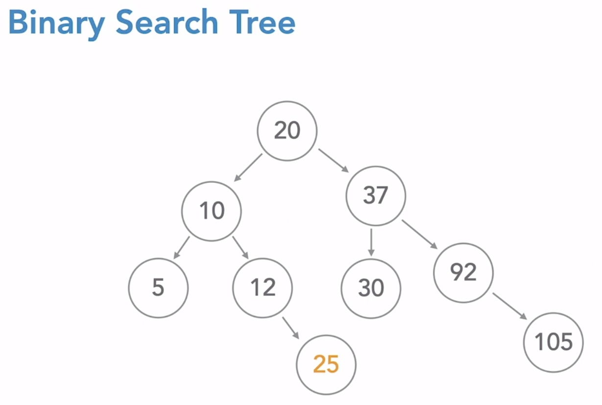
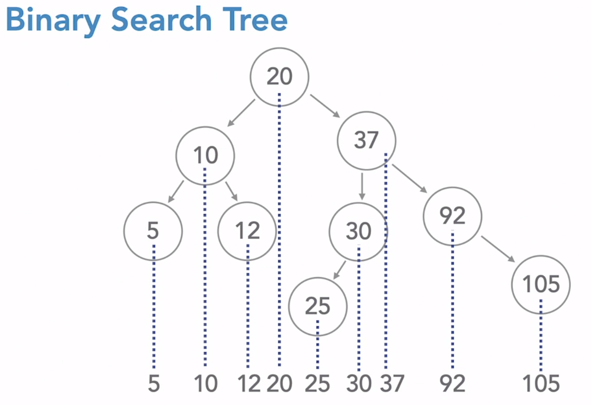
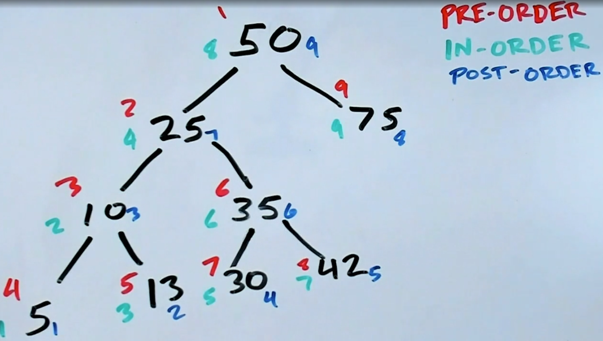
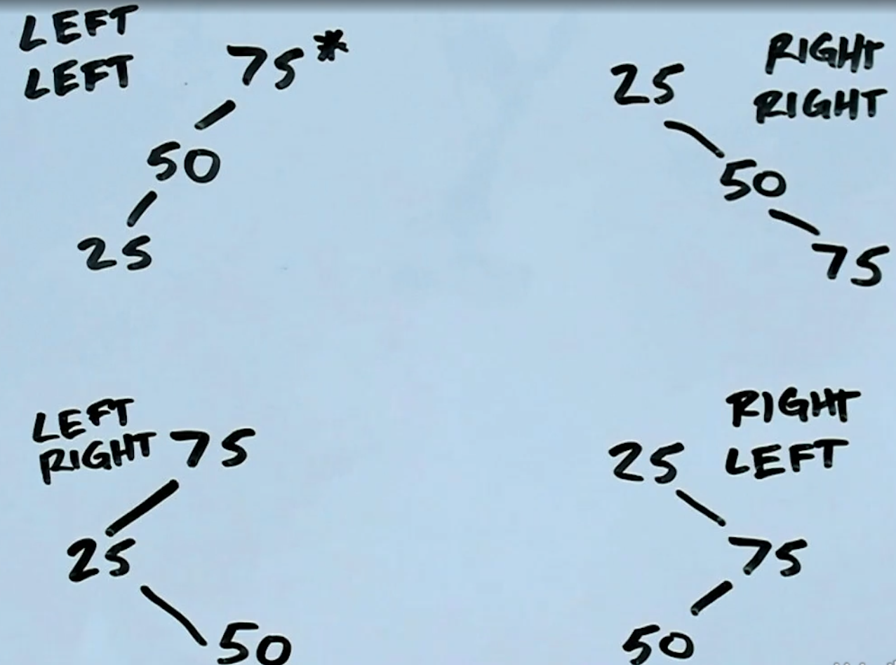
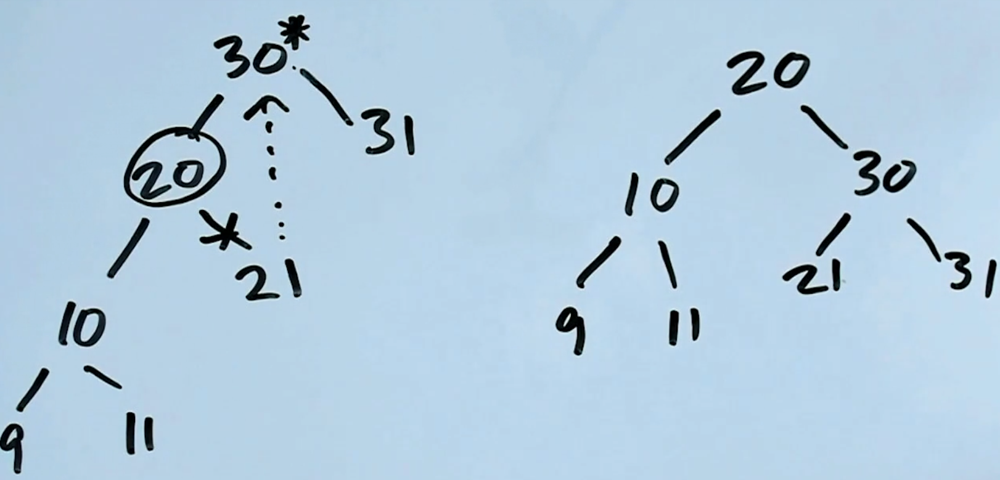
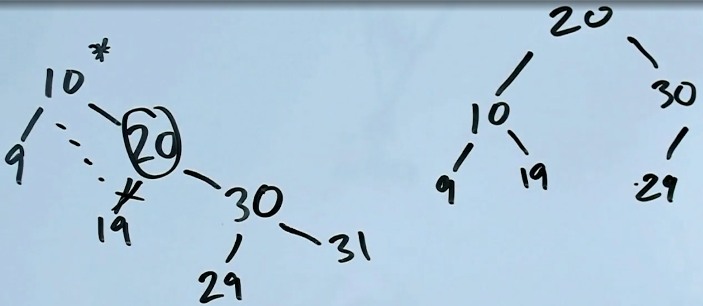
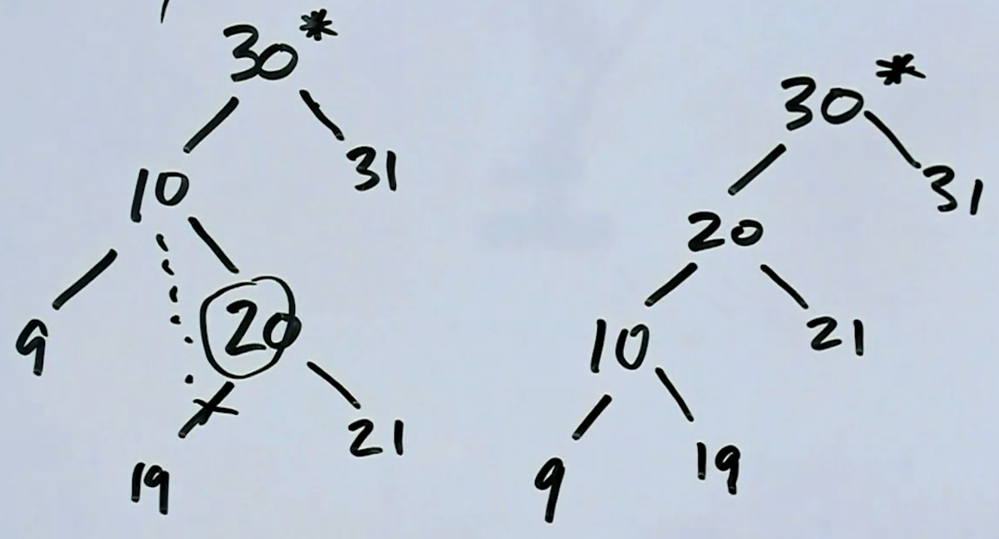

# Python Data Structures: Trees

## Definition

1. One root node
   1. Any node can be the root of its own tree
2. Each node has any number of children
3. Each node (except root) has one parent

### Optional Tree Features

- Nodes are associated with some data
- Rules about how many children a node can have
- Rules about how nodes are connected based on their data

### Binary Search Tree

- Each node has, at most, two children: left and right
- Each node has a numeric value associated with it
- Children to the left must have lesser values than their parents
- Children to the right must have greater values than their parents
- No duplicate values
- `Illegal`
  
- `Legal`
  

### Traversing a Tree

### Maths

- A BST with 100 nodes can have:

  - max 100 height (each node has 1 child)
  - min 2^(x+1) >= 100 or 2^7 (128) >= 100 then x = `6`

- What, approximately, is the maximum number of comparisons do you need to do to find data in a BST of height n?

  - You perform a comparison at every level of the tree until you find the node you're looking for then `N`

- If a tree has a height of 5, and has a missing node on level 2 (that is, 2 levels below the root) how many missing leaves does that correspond to at the 5th level?
  - 2^5 = 32
  - 2^2 = 4
  - The difference will be 32/4 = `8`

## Unbalanced Trees

- `Left Left`

- `Right Right`

- `Left Right`

- `Right Left`

## Rotating Trees

- Unbalanced `Left Left`: rotate `Right`
  

- Unbalanced `Right Right`: rotate `Left`
  

- Unbalanced `Left Right`: rotate `Left` then `Right`
  

- Unbalanced `Left Right`: rotate `Right` then `Left`
