# Python Parallel and Concurrent Programming

## Part 1

### 1 - Parallel Computing Hardware

#### Classification of multiprocessor architectures

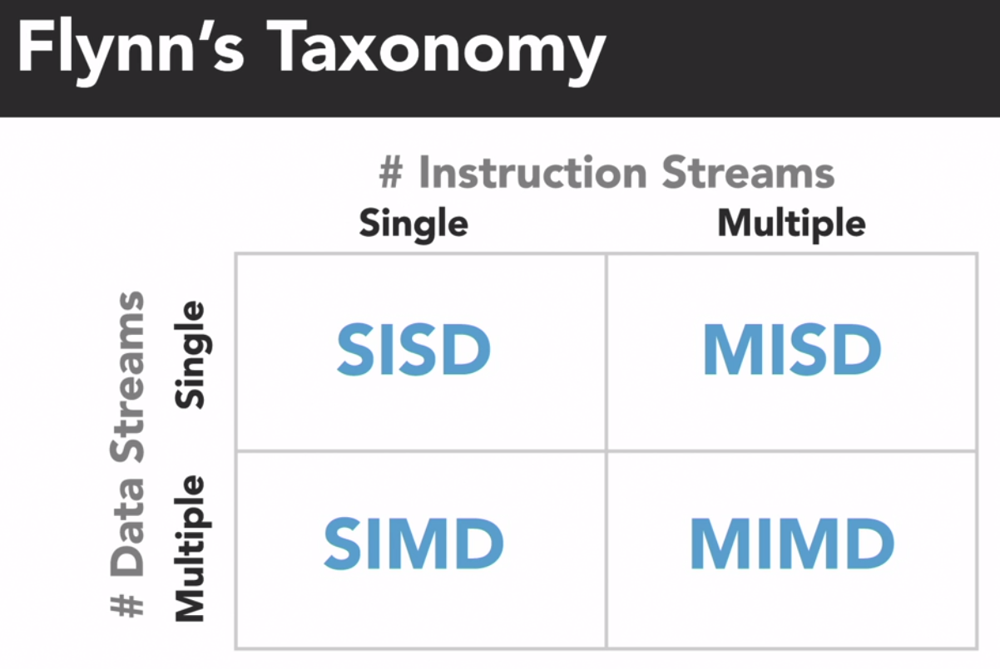
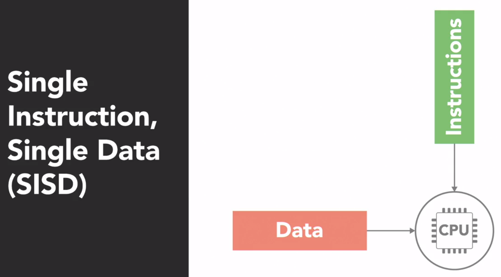
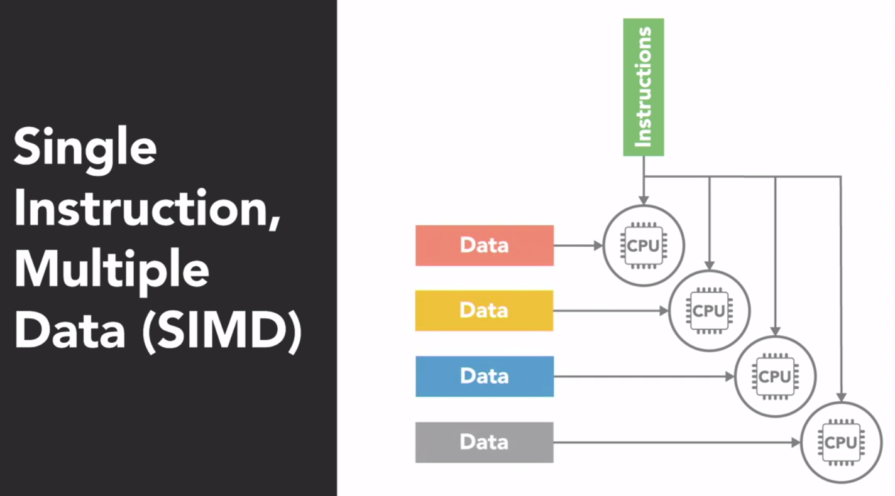
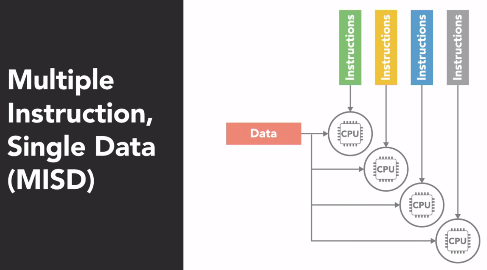
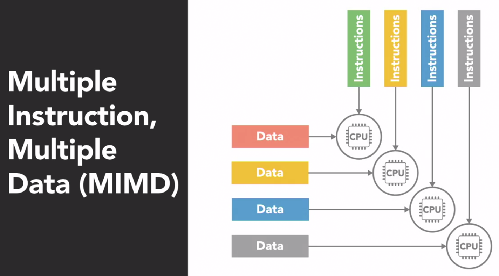

#### MIMD Parallel Programming Model

- Single Program, Multiple Data (`SPMD`)
  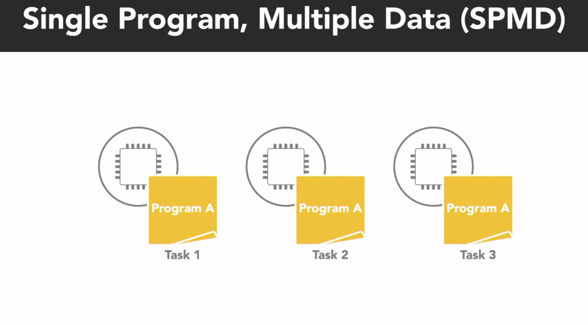

- Multiple Program, Multiple Data (`MPMD`)
  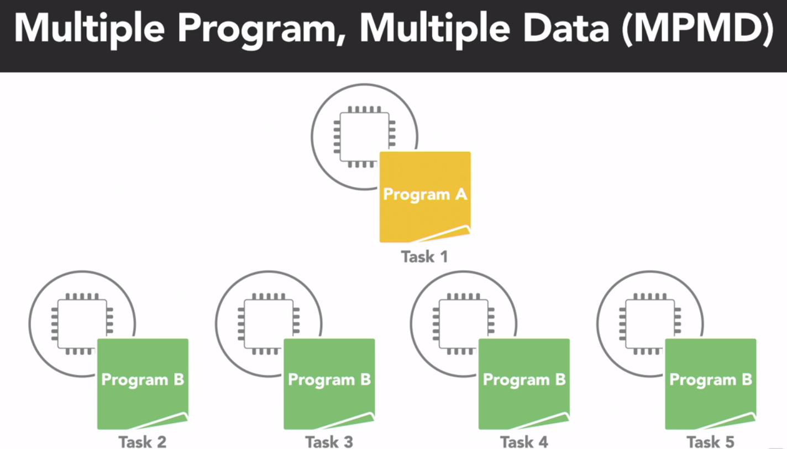

#### Memory

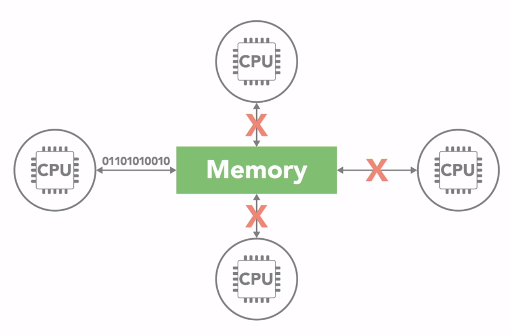

- Memory Speed < Processor Speed
- Shared Memory:

  - All processors access the same memory with global address space
  - `UMA`: Uniform memory access
    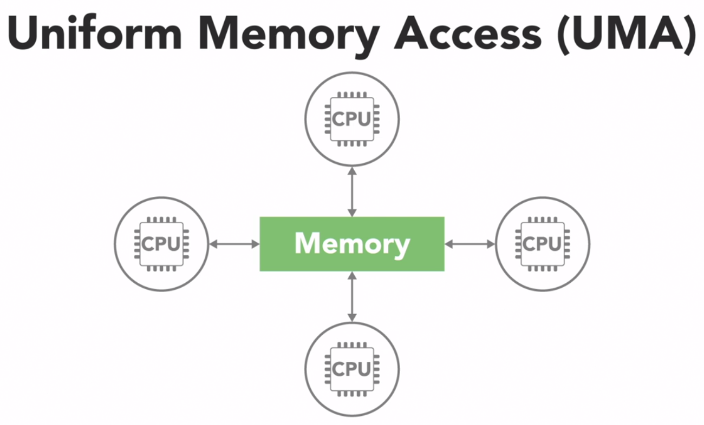
    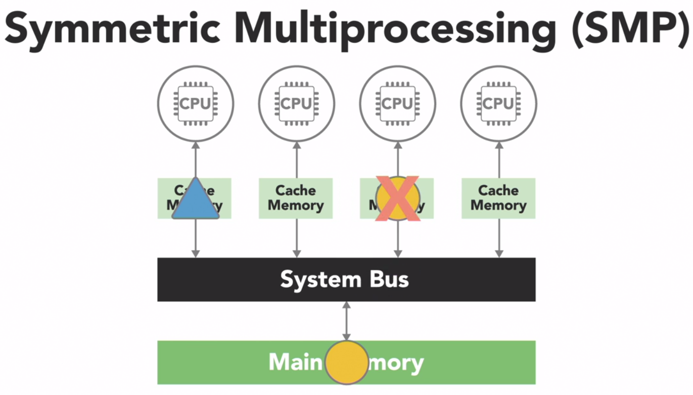

  - `NUMA`: Non-uniform memory access
    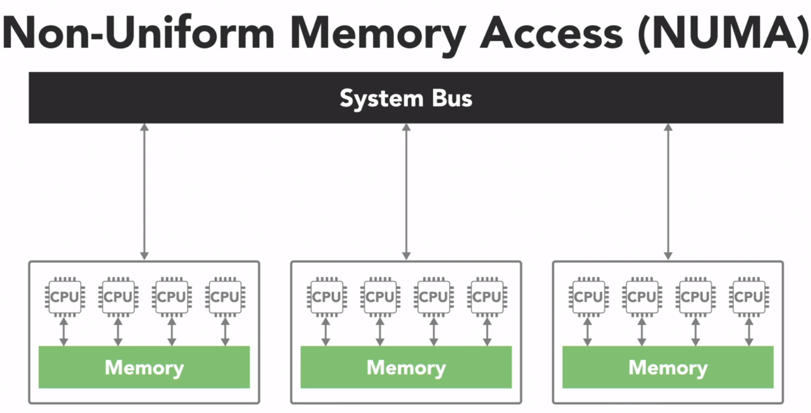

- Distributed Memory:
  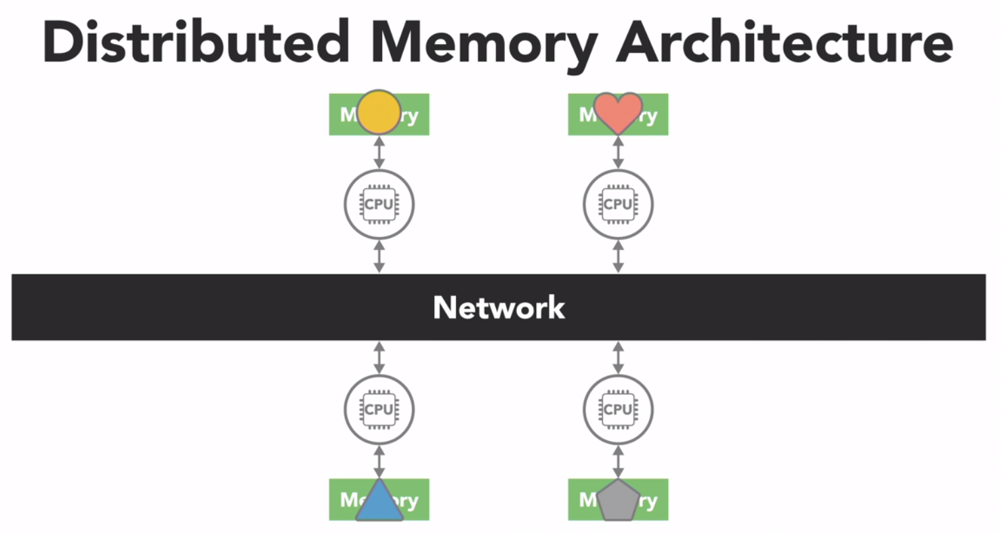

  - Scalable
    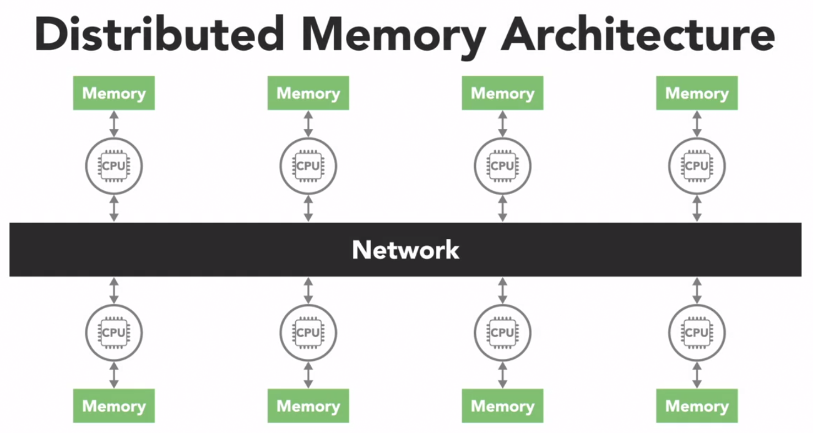

### 2 - Threads and processes

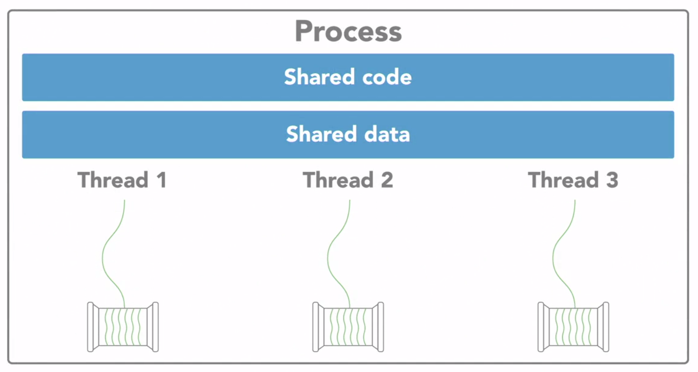

#### Process

- Includes code, data, and state information
- Independent instance of a running program
- Separate address space in memory
- `IPC` Inter-process communication
  - Sockets and pipes
  - Shared memory
  - Remote procedure calls

#### Threads

- Independent path of execution
- Subset of a process
- Operating system schedules threads for execution
- Lightweight: require less overhead to create and terminate
- OS can switch between threads faster than processes

#### Parallelism

- Simultaneous execution
- `Doing` multiple things at once
- CPU bound operations

#### Concurrency

- Ability of a program to be broken into parts that can run independently of each other
- Program Structure
- `Dealing` with multiple things at once
- I/O bound operations

#### Python GIL (Global Interpreter Lock)

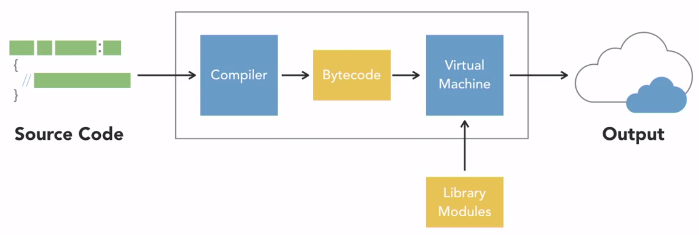

- Mechanism that limits Python to only execute one thread at a time
- CPython
  - Default and most widely used Python interpreter
  - Written in C and Python
  - Uses GIL for thread-safe operation

#### Scheduler

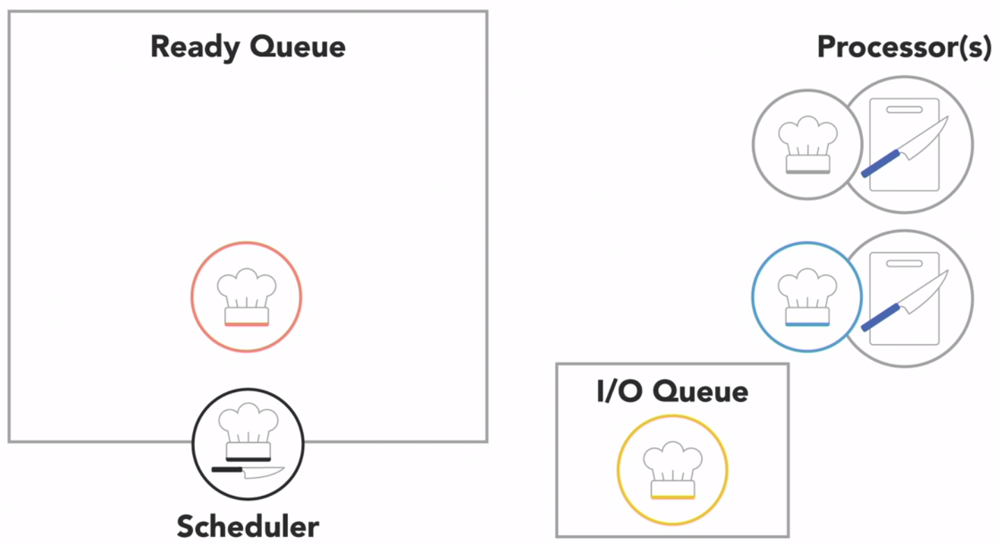

- Operating System function that assigns processes and threads to run on available CPUs
- Context Switch
  - Storing the state of a process or thread to resume later
  - Loading the saved state for the new process or thread to run
- Scheduling algorithms
  - First come, first served
  - Shortest job next
  - Priority
  - Shortest remaining time
  - Round-robin
  - Multiple-level queues
- Scheduling goals
  - Maximize throughput
  - Maximize fairness
  - Minimize wait time
  - Minimize latency

#### Thread Lifecycle

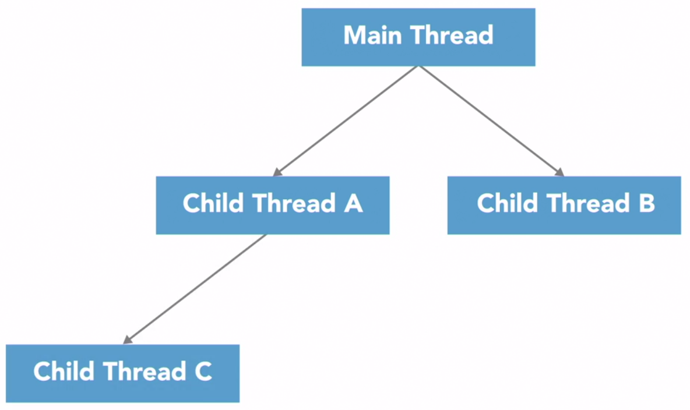
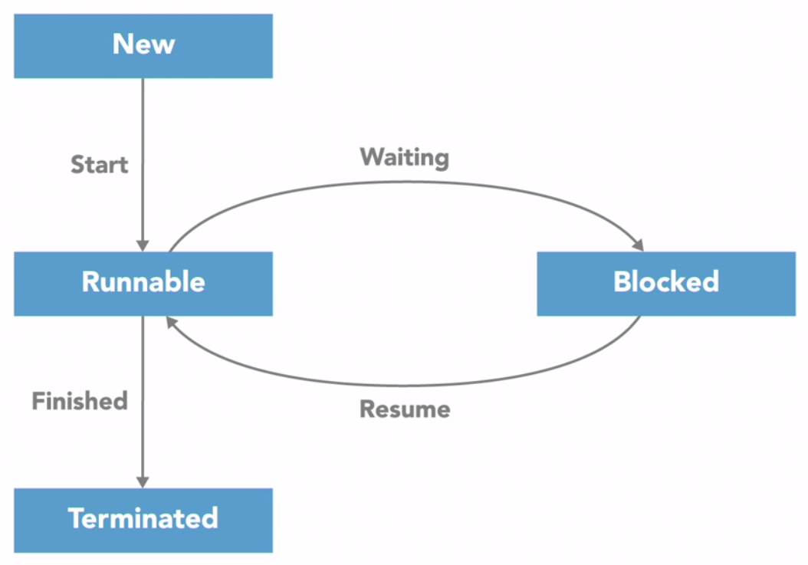

#### Daemon (Background) Thread

- Does not prevent the process from terminating
- By default,threads are created as non-daemon
- New threads will inherit daemon status from their parent
- Set the daemon property to change status before starting thread
- Daemon threads do not stop gracefully; when the program ends, remaining daemon threads will be abandoned

### 3 - Mutual Exclusion

#### Data Race (Race conditions)

- Two or more concurrent threads access the same memory location
- At least one thread is modifying it
- Detecting Data Races are hard to do
- Preventing them are a simpler task

#### Critical Section

- Code segment that accesses a shared resource
- Should not be executed by more than one thread or process at a time

#### Mutual Exclusion - MutEx (Lock)

- Mechanism to implement mutual exclusion
- Only one thread or process can possess at a time
- Limits access to critical session

#### Atomic Operations

- Execute a single action, relative to other threads
- Cannot be interrupted by other concurrent threads
- Critical section should be as short (fast) as possible

#### Acquiring a Lock

- If lock is already taken, block/wait for it to be available

### 4 - Locks

#### Deadlocks

- Thread tries to lock a MutEx which is already locked
- All processes and threads are unable to continue executing

#### Reentrant MutEx

- Can be locked multiple times by the same thread
- Must be unloacked as many times as it was locked
- Lock can be released by a different thread than was used to acquire it
- RLock must be released by the same thread that acquired it

#### Try Lock

- Non-blocking lock/acquire method for MutEx
- If the MutEx is available, lock it and return TRUE
- If the MutEx is not available, immediately return FALSE

#### Reader-Writer Lock

- `Shared Read`: multiple threads at once
- `Exclusive Write`: only one thread at a time
- Rule of thumb for when to use it: `#Threads Reading > #Threads Writing`

```bash
python -m venv .env
source .env/bin/activate
pip install readerwriterlock
```

- `RWLockFair`: fair priority for readers/writers
- `RWLockRead`: readers get priority
- `RWLockWrite`: writers get priority
- `gen_rlock()`: generates a reader lock object
- `gen_wlock()`: generates a writer lock object

### 5 - Liveness

#### Deadlock

- Each member is waiting for another member to take action

#### Liveness

- Properties that require a system to make progress
- Members may have to take turns in critical sections
  - Acquire global first lock
  - If could acquire first lock, acquire global second lock


- Dining phiosophers problem
  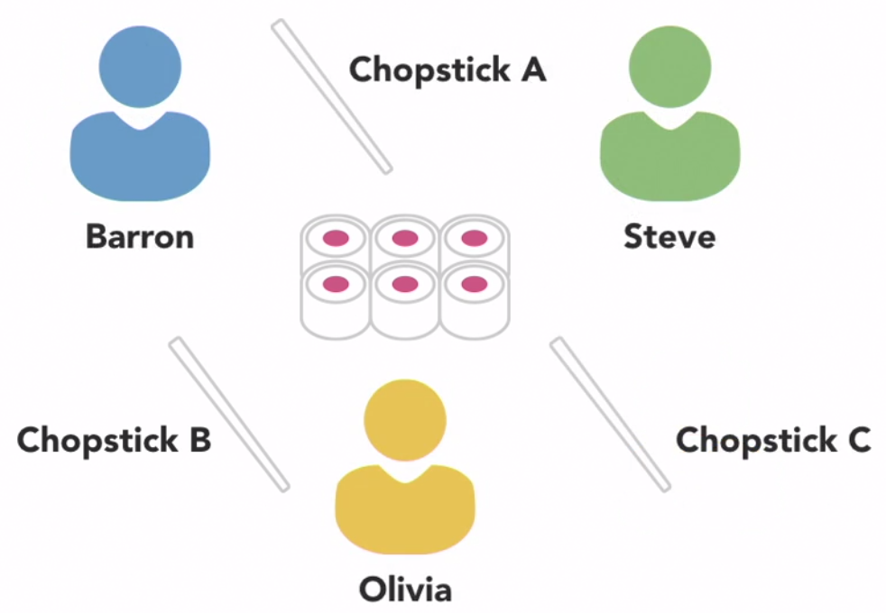

#### Lock Ordering

- Ensure locks are always taken in the same order by any thread

#### Lock Timeout

- Put a timeout on lock attempts
- If a thread cannot acquire all locks within the time limit:
  1. Back up and free all locks taken
  2. Wait for a random amount of time
  3. Try again

#### Abandoned Lock

#### Starvation

- A process or thread is perpetually denied the resources it needs

#### Livelock

- Multiple threads or processes actively responding to each other to resolve conflict, but that prevents them from making progress

## Part 2
