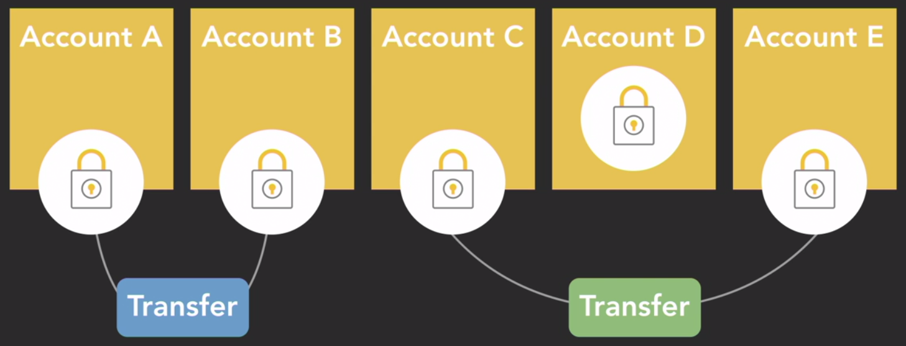

# Python Parallel and Concurrent Programming

## Part 1

### 1 - Parallel Computing Hardware

#### Classification of multiprocessor architectures


#### MIMD Parallel Programming Model

- Single Program, Multiple Data (`SPMD`)
  

- Multiple Program, Multiple Data (`MPMD`)
  

#### Memory


- Memory Speed < Processor Speed
- Shared Memory:

  - All processors access the same memory with global address space
  - `UMA`: Uniform memory access
    
    

  - `NUMA`: Non-uniform memory access
    

- Distributed Memory:
  

  - Scalable
    

### 2 - Threads and processes


#### Process

- Includes code, data, and state information
- Independent instance of a running program
- Separate address space in memory
- `IPC` Inter-process communication
  - Sockets and pipes
  - Shared memory
  - Remote procedure calls

#### Threads

- Independent path of execution
- Subset of a process
- Operating system schedules threads for execution
- Lightweight: require less overhead to create and terminate
- OS can switch between threads faster than processes

#### Parallelism

- Simultaneous execution
- `Doing` multiple things at once
- CPU bound operations

#### Concurrency

- Ability of a program to be broken into parts that can run independently of each other
- Program Structure
- `Dealing` with multiple things at once
- I/O bound operations

#### Python GIL (Global Interpreter Lock)


- Mechanism that limits Python to only execute one thread at a time
- CPython
  - Default and most widely used Python interpreter
  - Written in C and Python
  - Uses GIL for thread-safe operation

#### Scheduler


- Operating System function that assigns processes and threads to run on available CPUs
- Context Switch
  - Storing the state of a process or thread to resume later
  - Loading the saved state for the new process or thread to run
- Scheduling algorithms
  - First come, first served
  - Shortest job next
  - Priority
  - Shortest remaining time
  - Round-robin
  - Multiple-level queues
- Scheduling goals
  - Maximize throughput
  - Maximize fairness
  - Minimize wait time
  - Minimize latency

#### Thread Lifecycle


#### Daemon (Background) Thread

- Does not prevent the process from terminating
- By default,threads are created as non-daemon
- New threads will inherit daemon status from their parent
- Set the daemon property to change status before starting thread
- Daemon threads do not stop gracefully; when the program ends, remaining daemon threads will be abandoned

### 3 - Mutual Exclusion

#### Data Race

- Two or more concurrent threads access the same memory location
- At least one thread is modifying it
- Detecting Data Races are hard to do
- Preventing them are a simpler task

#### Critical Section

- Code segment that accesses a shared resource
- Should not be executed by more than one thread or process at a time

#### Mutual Exclusion - MutEx (Lock)

- Mechanism to implement mutual exclusion
- Only one thread or process can possess at a time
- Limits access to critical session

#### Atomic Operations

- Execute a single action, relative to other threads
- Cannot be interrupted by other concurrent threads
- Critical section should be as short (fast) as possible

#### Acquiring a Lock

- If lock is already taken, block/wait for it to be available

### 4 - Locks

#### Deadlocks

- Thread tries to lock a MutEx which is already locked
- All processes and threads are unable to continue executing

#### Reentrant MutEx

- Can be locked multiple times by the same thread
- Must be unloacked as many times as it was locked
- Lock can be released by a different thread than was used to acquire it
- RLock must be released by the same thread that acquired it

#### Try Lock

- Non-blocking lock/acquire method for MutEx
- If the MutEx is available, lock it and return TRUE
- If the MutEx is not available, immediately return FALSE

#### Reader-Writer Lock

- `Shared Read`: multiple threads at once
- `Exclusive Write`: only one thread at a time
- Rule of thumb for when to use it: `#Threads Reading > #Threads Writing`

```bash
python -m venv .env
source .env/bin/activate
pip install readerwriterlock
```

- `RWLockFair`: fair priority for readers/writers
- `RWLockRead`: readers get priority
- `RWLockWrite`: writers get priority
- `gen_rlock()`: generates a reader lock object
- `gen_wlock()`: generates a writer lock object

### 5 - Liveness

#### Deadlock

- Each member is waiting for another member to take action

#### Liveness

- Properties that require a system to make progress
- Members may have to take turns in critical sections
  - Acquire global first lock
  - If could acquire first lock, acquire global second lock



- Dining phiosophers problem
  

#### Lock Ordering

- Ensure locks are always taken in the same order by any thread

#### Lock Timeout

- Put a timeout on lock attempts
- If a thread cannot acquire all locks within the time limit:
  1. Back up and free all locks taken
  2. Wait for a random amount of time
  3. Try again

#### Abandoned Lock

#### Starvation

- A process or thread is perpetually denied the resources it needs

#### Livelock

- Multiple threads or processes actively responding to each other to resolve conflict, but that prevents them from making progress

## Part 2

### 1 - Synchronization

#### Condition Variable

- Queue of threads waitig for a certain condition
- Associated with a MutEx
- 3 main operations:
  - `wait`
    - Automatically release lock on the mutex
    - Go to sleeep and enter waiting queue
    - Reacquire lock when woken up
  - `signal`
    - Wake up one thread fro the conditional variable queue
    - Also called notify or wake
  - `broadcast`
    - Wake up all threads from the conditional variable queue
    - Also called notify all or wake all

#### Monitor

- Protect section of the code with mutual exclusion
- Provide ability for threads to wait until a condition occurs


#### Shared Queue or Buffer

- MutEx
- Condition variables
  - `BufferNotFull`
  - `BufferNotEmpty`

#### Producer-Consumer Pattern

- `FIFO`
- `Producer`
  - Add elements to shared data structure
- `Consumer`
  - Remove elements from shared data structure
- Synchronization Challenges
  - Enforce mutual exclusion of procedures and consumers
  - Prevent producers from trying to add data to a full queue
  - Prevent consumers from trying to remove data from an empty queue

#### Unbounded queue

- A queue with an unlimited capacity (...limited by memory capacity)

#### Pipeline


#### Semaphore

- Synchronization mechanism
- Can be used by multiple threads at the same time
- Includes a counter to track availability
- `acquire()`
  - if counter is positive, decrement counter
  - If counter is zero, wait until available
- `release()`
  - Increment counter
  - Signal waiting thread

#### Counting Semaphore

- Value `>= 0`
- Used to track limited resources
  - Pool of connections
  - Items in a queue

#### Binary Semaphore

- Value `1 or 0`
  - 0 => locked
  - 1 => unlocked
- Used similar to MutEx by acquiring/releasing
  - Diff: MutEx can only be acquired/released by the same thread

#### Producer/Consumer Semaphore


### 2 - Barriers

#### Race Conditions

- Different from Data Races
- `Data Races`:
  - 2 or more threads concurrently access the same memory location
  - If at least one of those threads are writing to or changing the memory value
- `Race Conditions`:
  - Flaw in the timing or ordering in which threads are executed
  - Many race conditions are caused by data races
- Searching for Race Conditions
  - Use sleep statements to modify timing and execution order
- Heisenbug
  - A software bug that disappears when you try to study it

#### Barrier

- Prevents a group of threads from proceeding until enough threads have reached the barrier


### 3 - Asynchronous Tasks

#### Computational Graph

- DAG: Directed Acyclic Graph
  
  
  
  

#### Thread Pool

- Creates and maintains a collection of woker threads
- Reuses existing threads to execute tasks
- `suhtdown()`
  - free up ThreadPoolExecutor resources after pending tasks finish


#### Future

- Placeholder for a result that will be available later
- Mechanism to access the result of an asynchronous operation
- Returned by the `Executor.submit()` method
- `Future Class`
  - `cancel()`
  - `cancelled()`
  - `running()`
  - `done()`
  - `result()`

#### Divide and Conquer Algorithms

1. Divide the problem into subproblems
2. Conquer the subproblems by solving them recursively
3. Combine the solutions to the subproblems

- if base case:
  - solve problem
- else:
  - partition problem into "left" and "right" subproblems
  - solve "left" problem using divide-and-conquer
  - solve "right" problem using divide-and-conquer
  - combine solutions to "left" and "right" problems

### 4 - Evaluating Parallel Performance


#### Weak Scaling

- Variable number of processors with fixed problem size per processor
- Accomplish more work in the same time

#### Strong Scaling

- Variable number of processors with fixed total problem size
- Accomplish same work in less time

#### Amdahl's law


#### Efficiency


- How well additional resources are utilized

### 5 - Designing Parallel Programs


#### Parallel Design Stages

- Partitioning
  - Break down the problem into discrete pieces of work
  - Domain (data) decomposition
    
    - Divide the data in small (and if possible, equally sized) partitions
  - Functional decomposition
    
    - Divide the whole computation into several tasks which will perform part of the work
- Communication

  - Coordinate task execution and share information

  
  
  

  - `Synchronous` _Blocking_ Communication
    - Tasks wait until entire communication is complete
    - Cannot do other work while in progress
  - `Asynchronous` _Non Blocking_ Communication
    - Tasks do not wait for communication to complete
    - Can do other work while in progress
  - `Overhead`
    - Compute time/resources spent on communication
  - `Latency`
    - Time to send message from A to B (microseconds)
  - Bandwidth
    - Amount of data communicated per seconds (byte/s)

- Agglomeration

  - Combine tasks and replicate data/computation to increase efficiency
  - Fine-Grained Parallelism
    - Large number of small tasks
    - Advantage: Good distribution of workload (load balancing)
    - Disadvantage: Low computation-to-communication ratio
      
  - Coarse-Grained Parallelism
    - Small number of large tasks
    - Advantage: High computation-to-communication ratio
    - Disadvantage: Inefficient load balancing
      

- Mapping
  - Minimize the total execution time
  - Does not appply to:
    - Single-core processors
    - Automated task scheduling
  - Strategies
    - Place tasks that can execute concurrently on different processors
    - Place tasks that communicate frequently on the same processor
