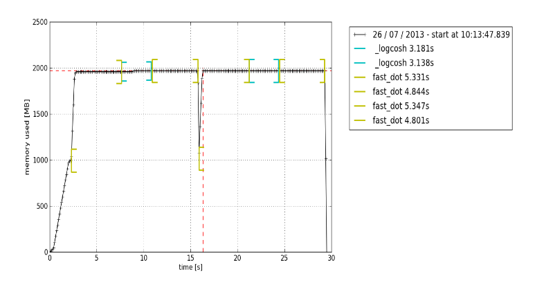

# Python Memory Management

<https://scoutapm.com/blog/python-memory-management>

## Writing memory-efficient code

- Faster processing and less need for resources, namely random access memory (RAM) usage
- Prevents memory leak
  - RAM usage to continuously increase even when processes are killed, eventually leading to slowed or impaired device performance

## Python Memory Allocation

- Objects need to be stored in the memory to be accessed
- A chunk of memory must first be allocated or assigned for each before they can be stored
- Python's raw memory allocator will first make sure that there is available space in the private heap
  - interacts with the memory manager of the operating system
- Object-specific allocators operate on the same heap and implement distinct management policies depending on the object type
  - Computers need different storage requirements and speed tradeoffs for integers as compared to strings
- Python's heap is managed: zero control over it

## Static vs. Dynamic Memory Allocation

### Static

- Statically allocated variables are permanent, meaning they need to be allocated beforehand and last as long as the program runs
- Memory is allocated during compile time, or before program execution
- Implemented using the stack data structure
- Memory that has been allocated cannot be reused

### Dynamic

- Dynamically allocated variables are not permanent and can be allocated as a program is running
  - Do not need to worry about how much memory we need for our program beforehand
- Memory is allocated at runtime or during program execution
  - It will consume more time for its completion
  - Memory that has been allocated needs to be freed after it has been used
- Implemented using the heap data structure
- Memory that has been allocated can be released and reuse

### Stack Memory

- All methods and their variables are stored in the stack memory
- Access to this type of memory is very fast
- Responsible for setting the scope for the variables of a method
- When a method is called in Python, a stack frame is allocated
  - Will handle all the variables of the method
  - After the method is returned, the stack frame is automatically destroyed

### Heap Memory

- All objects and instance variables are stored in the heap memory
- Upon creation, objects stored in a private heap which will then allow for allocation and deallocation
- Enables these variables to be accessed globally by all your program's methods
- After the variable is returned, the Python garbage collector gets to work

## Python Memory Structure

### Large Objects

- Are directed to the standard C allocator within Python

### Arenas

- Largest possible chunck of memory
- 256 KiB
- 64 pools
- Memory mappings that are used by the Python allocator, pymalloc

### Pools

- 4 KiB
- States:
  - Empty: available for allocation
  - Used: contains objects which cause it to be neither empty nor full
  - Full: not available for any more allocation
- Broken down into many blocks

### Blocks

- Smallest memory structures
- Has no fixed size: 8 to 512 bytes and must be a multiple of 8
- States:
  - Untouched: Has not been allocated
  - Free: Has been allocated but was released and made available for allocation
  - Allocated: Has been allocated

## Python Garbage Collection

- Release previously allocated memory for an object that is no longer in use
- Python uses reference counting combined with generational garbage collection to free up unused memory
- Generational garbage collection
  - Initializes a "discard list" for unused objects
  - Algorithm is run to detect reference cycles
  - If an object is missing outside references, it is inserted into the discard list
  - Frees up memory allocation for the objects in the discard list

## Monitoring Python Memory Issues

- Python memory manager does not necessarily release the memory back to the operating system
  - May not trigger appropriate actions, like garbage collection, memory compaction or other preventive measures
- One may have to explicitly free up memory in Python
  - Force the Python garbage collector to release unused memory by making use of the gc module
  - `gc.collect()`
  - Only provides noticeable benefits when manipulating a very large number of objects
- Python libraries have also been known to cause memory leaks
  - Pandas
- Infinitely growing data structures is another cause of concern

## Application Performance Monitoring (APM) Tools

- Observe real-time performance metrics of a program, enabling continuous optimization

### Profile Modules

#### Tracemalloc

- Traceback where an object was allocated
- Statistics on allocated memory blocks per filename and per line number:
  - total size
  - number
  - average size of allocated memory blocks
- Compute the difference between two snapshots to detect memory leaks

#### Memory-profiler

- Simply add the @profile decorator to any function that you wish to investigate
- Quick check to see if memory usage continues to increase indefinitely or not

## Best Practices for Improving Python Code Performance

- Take advantage of Python libraries and built-in functions
- Not using `+` for string concatenation
- Using `itertools` for efficient looping
- Use Generators, Not Lists for Big Arrays
- Use Numpy (or similar libraries) for Extensive Mathematical Operations
