# Python Browser Automation

## 02 (b) - Browser Automation

<https://chromedriver.chromium.org/home>
<https://docs.python.org/3/library/datetime.html>
<https://docs.python.org/3/library/time.html>
<https://requests.readthedocs.io/en/latest/>
<https://www.selenium.dev/documentation/webdriver/>

```bash
# https://www.selenium.dev/documentation/webdriver/
pip install selenium
pip install requests
pip install beautifulsoup4
```

## 04 (d) - APIS

<https://developers.facebook.com/docs/graph-api/reference>
<https://flask.palletsprojects.com/en/2.0.x/>
<https://languagetool.org/http-api/>
<https://newsapi.org/>
<https://openweathermap.org/>
<https://www.json.org/json-en.html>

```bash
pip install python-dotenv
pip install Flask
```

## 05 (e) - Files and Folders

<https://docs.python.org/3/library/pathlib.html>
<https://docs.python.org/3/library/zipfile.html>

## 06 (f) - Emails

<https://docs.python.org/3/library/os.html>
<https://docs.python.org/3/library/smtplib.html>
<https://pandas.pydata.org/docs/>
<https://pythonhow.com/how/store-python-passwords-securely-on-windows-mac-and-linux/>
<https://www.pythonanywhere.com/>
<https://yagmail.readthedocs.io/en/latest/>

```bash
pip install yagmail
pip install pandas
```

## 07 (g) - PDFs

<http://www.fpdf.org/>
<https://pymupdf.readthedocs.io/en/latest/>
<https://tabula-py.readthedocs.io/en/latest/>

```bash
pip install fpdf
pip install openpyxl
pip install pymupdf
pip install tabula-py
```

## 08 (h) - Modern Tools

<https://deepnote.com/workspace/redpillcorp-a4b18895-b130-459f-b163-6bb7525b51c3>
<https://docs.streamlit.io/>
<https://replit.com/repls>
<https://www.notion.so/Getting-Started-bdf277ba70be4dd7b962517fe2a2805f>
<https://www.pythonanywhere.com/user/gusw/>

```bash
pip install streamlit
```

## 09 (i) - Web and Desktop Apps

<https://www.riverbankcomputing.com/software/pyqt/>

```bash
pip install PyQt6
```

## 11 (k) - Google Sheets

<https://docs.gspread.org/en/latest/>
<https://docs.python.org/3/library/re.html>
<https://docs.python.org/3/library/statistics.html>

```bash
pip install gspread
```

### Getting Google Developer Private Key to Google Drive API

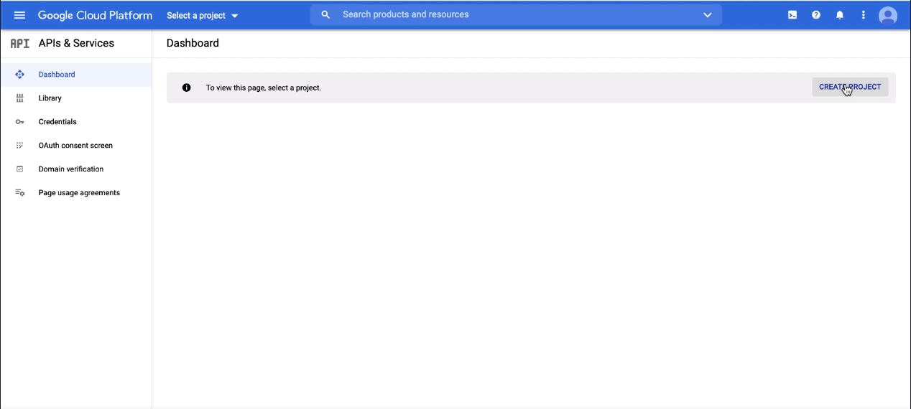
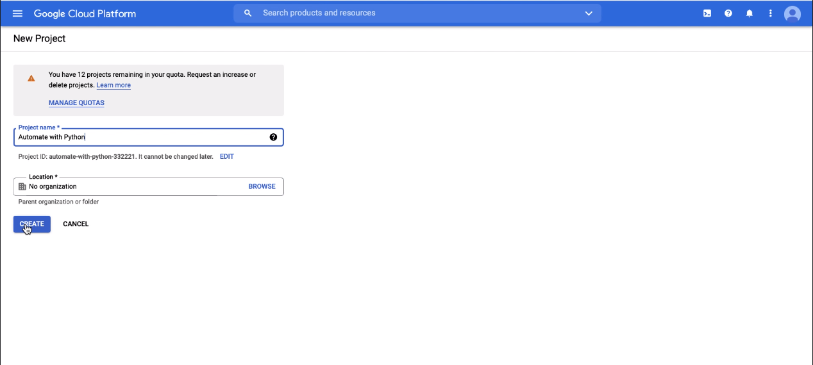
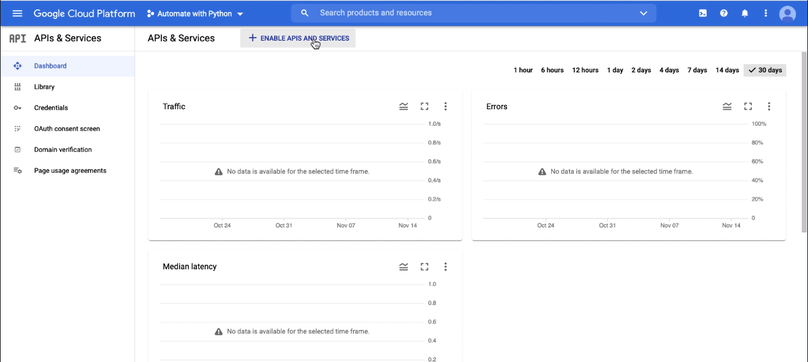
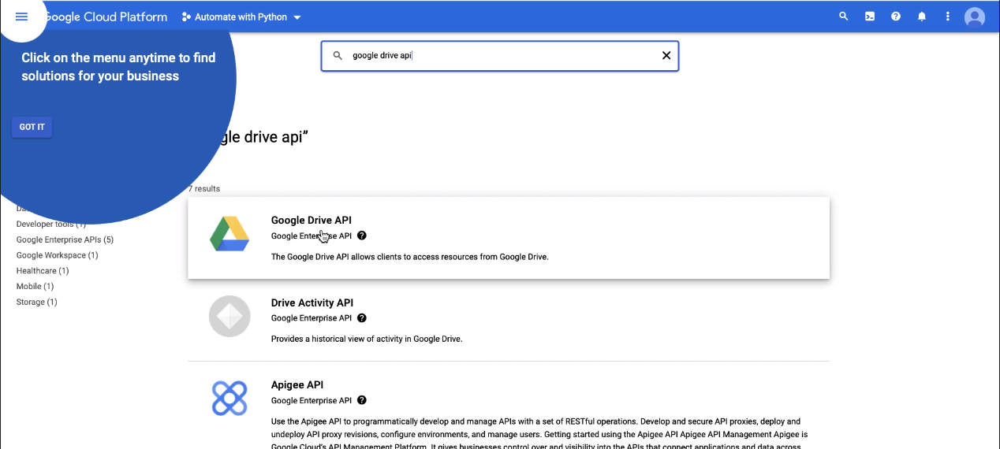
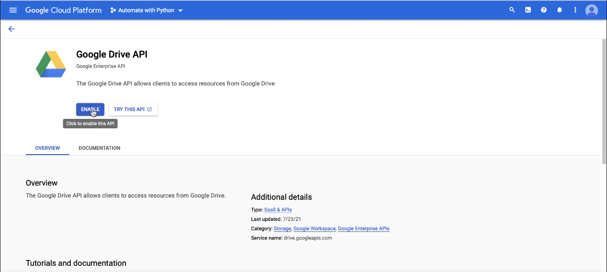
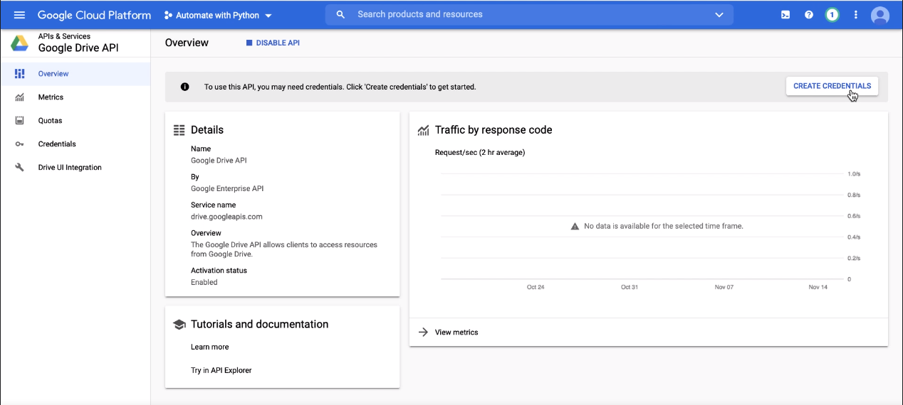
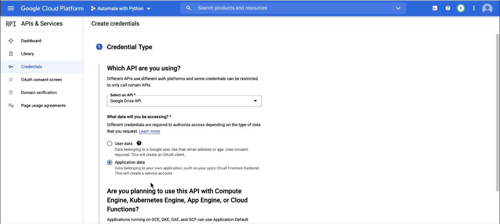
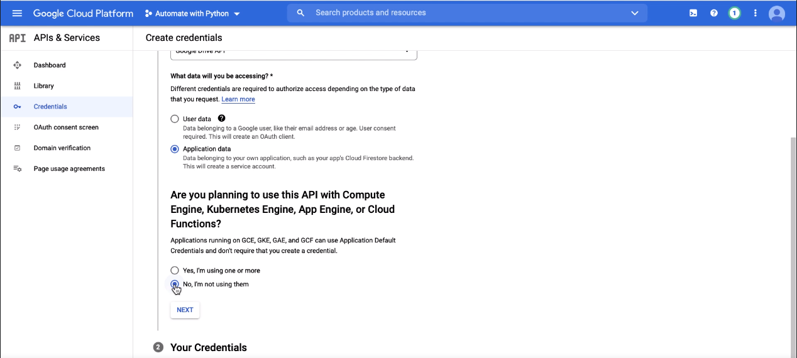
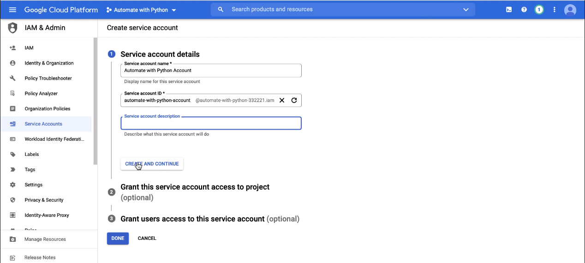
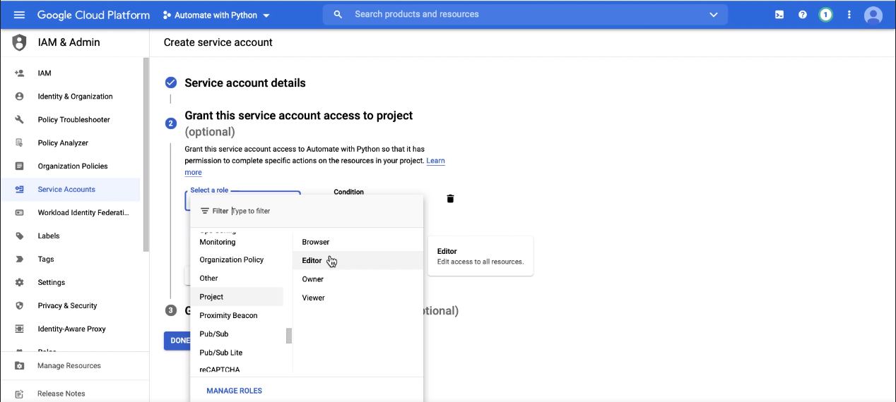
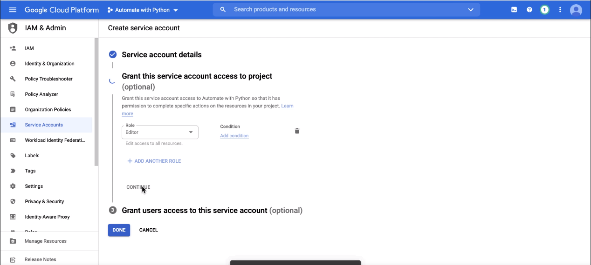
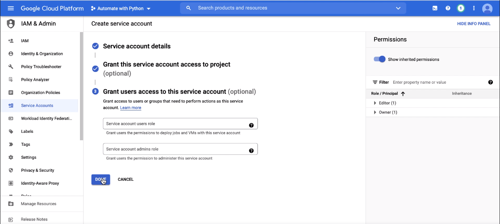
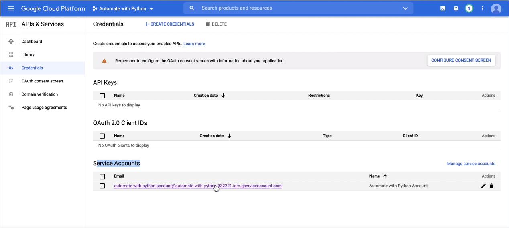
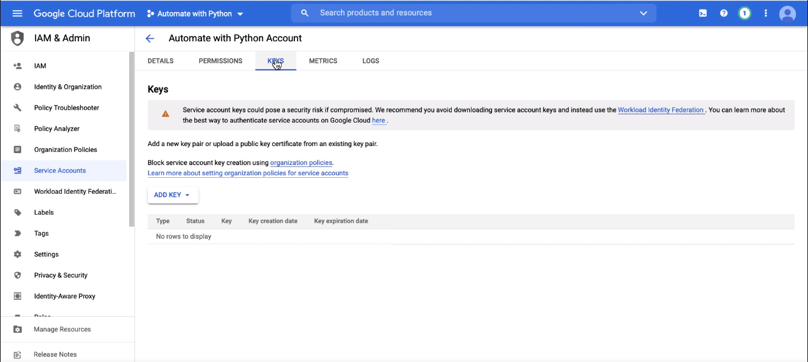
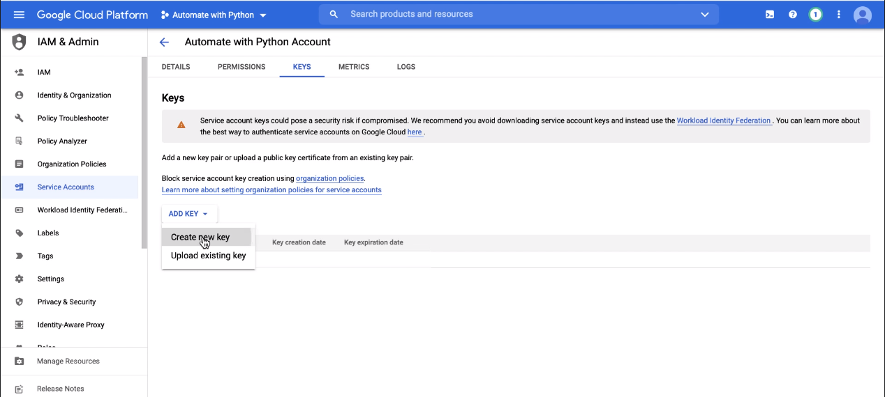
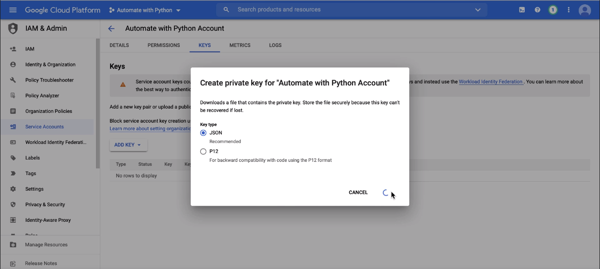

## 12 (l) - Image Processing

<https://docs.opencv.org/4.x/d6/d00/tutorial_py_root.html>
<https://numpy.org/doc/>

```bash
pip install opencv-python
```

## 17 (q) - NLP (Natural Language Processing)

<https://www.nltk.org/>

```bash
pip install nltk
pip install sklearn
```

## 18 (r) - Chatbots

<https://wikipedia.readthedocs.io/en/latest/code.html#api>

```bash
pip install wikipedia
```

## 20 (t) - Downloading, Uploading, Sharing files

<https://requests.readthedocs.io/en/latest/>

```bash
pip install filestack-python
```
